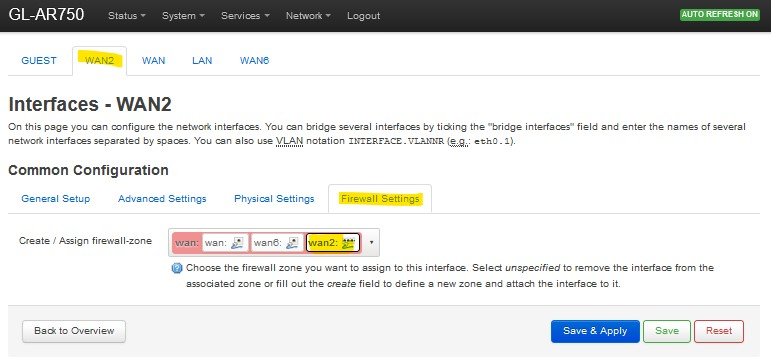
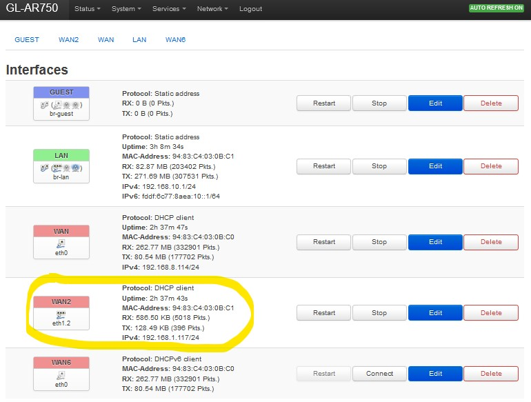
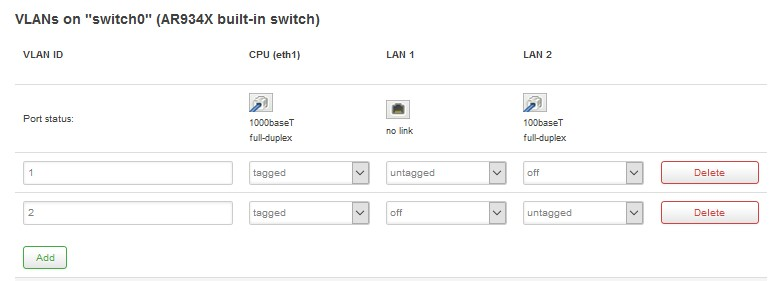
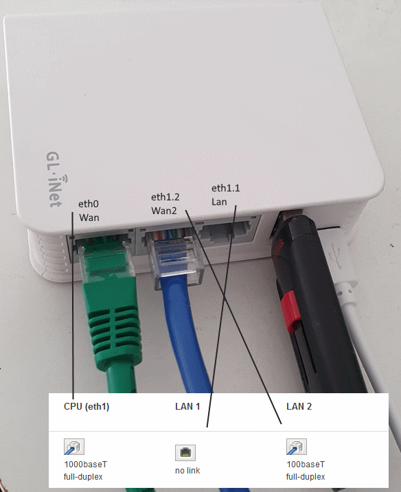

# OpenWrt - GL.iNet AR-750 Use LAN port as 2nd WAN in order to use Mwan3

## Introduction

How to configure the network of a [GL-AR750](https://openwrt.org/toh/gl.inet/gl-ar750) device, using [OpenWRT](https://openwrt.org/), in order to use a LAN port as your second WAN, so that afterwards you can configure [Mwan3](https://openwrt.org/docs/guide-user/network/wan/multiwan/mwan3) to load balance Wan connections.

## Table Of Contents

<!-- toc -->

- [Network configuration file](#Network-configuration-file)
- [Applying the changes](#Applying-the-changes)
- [Firewall configurations](#Firewall-configurations)
- [Testing](#Testing)
- [How things will show up in the web interface](#How-things-will-show-up-in-the-web-interface)
- [Configure Mwan3](#Configure-Mwan3)
- [Troubleshooting](#Troubleshooting)

<!-- tocstop -->

## Network configuration file

- Start by connecting to the machine via ssh.

- Before changing the file I suggest you create a copy of your original network configuration

```bash
root@GL-AR750:~# cp /etc/config/network /etc/config/network.bak
```

### The changes to make

Edit the network configuration file in your favorite editor, or use [WinSCP](https://winscp.net/) to edit the file remotly (needs [SFTP](https://openwrt.org/docs/guide-user/services/nas/sftp.server) installed)

```bash
root@GL-AR750:~# vi /etc/config/network
```

Steps to take:

- Remove from the VLAN the LAN interface we want to configure as WAN

From:

```bash
config switch_vlan
	option device 'switch0'
	option vlan '1'
	option ports '1 2 0t'

```

To:

```bash
config switch_vlan
	option device 'switch0'
	option vlan '1'
	option ports '1 0t'

```

- Create a new VLAN that includes the LAN port we want to use as WAN

Add:

```bash
config switch_vlan
	option device 'switch0'
	option vlan '2'
	option ports '2 0t'

```

- Add a new WAN Interface that uses the new VLAN we just created (eth1.2 in this case). It needs to have a different metric and hostname.

Add:

```bash
config interface 'wan2'
	option ifname 'eth1.2'
	option proto 'dhcp'
	option hostname 'GL-AR750-bc1'
	option metric '11'
	option delegate '0'

```

- Here is how the file should look after the changes (if you started from the original file)

You can download it [here](network.txt)

```bash
config interface 'loopback'
	option ifname 'lo'
	option proto 'static'
	option ipaddr '127.0.0.1'
	option netmask '255.0.0.0'

config globals 'globals'
	option ula_prefix 'fddf:6c77:8aea::/48'

config interface 'lan'
	option type 'bridge'
	option ifname 'eth1.1'
	option proto 'static'
	option netmask '255.255.255.0'
	option ip6assign '60'
	option hostname 'GL-AR750-bc0'
	option ipaddr '192.168.10.1'
	option delegate '0'

config interface 'wan'
	option ifname 'eth0'
	option proto 'dhcp'
	option hostname 'GL-AR750-bc0'
	option metric '10'

config interface 'wan2'
	option ifname 'eth1.2'
	option proto 'dhcp'
	option hostname 'GL-AR750-bc1'
	option metric '11'
	option delegate '0'

config interface 'wan6'
	option ifname 'eth0'
	option proto 'dhcpv6'
	option auto '0'

config switch
	option name 'switch0'
	option reset '1'
	option enable_vlan '1'

config switch_vlan
	option device 'switch0'
	option vlan '1'
	option ports '1 0t'

config switch_vlan
	option device 'switch0'
	option vlan '2'
	option ports '2 0t'

config interface 'guest'
	option ifname 'guest'
	option type 'bridge'
	option proto 'static'
	option ipaddr '192.168.9.1'
	option netmask '255.255.255.0'
	option ip6assign '60'

```

<details>
<summary>Original network file</summary>

You can download it [here](network.bak)

```bash
config interface 'loopback'
	option ifname 'lo'
	option proto 'static'
	option ipaddr '127.0.0.1'
	option netmask '255.0.0.0'

config globals 'globals'
	option ula_prefix 'fddf:6c77:8aea::/48'

config interface 'lan'
	option type 'bridge'
	option ifname 'eth1.1'
	option proto 'static'
	option netmask '255.255.255.0'
	option ip6assign '60'
	option hostname 'GL-AR750-bc0'
	option ipaddr '192.168.10.1'
	option delegate '0'

config interface 'wan'
	option ifname 'eth0'
	option proto 'dhcp'
	option hostname 'GL-AR750-bc0'
	option metric '10'

config interface 'wan6'
	option ifname 'eth0'
	option proto 'dhcpv6'

config switch
	option name 'switch0'
	option reset '1'
	option enable_vlan '1'

config switch_vlan
	option device 'switch0'
	option vlan '1'
	option ports '1 2 0t'

config interface 'guest'
	option ifname 'guest'
	option type 'bridge'
	option proto 'static'
	option ipaddr '192.168.9.1'
	option netmask '255.255.255.0'
	option ip6assign '60'
```
</details>


## Applying the changes

Force a network restart:

```bash
root@GL-AR750:~# /etc/init.d/network restart
```

you might need to reboot
```bash
root@GL-AR750:~# reboot
```

## Firewall configurations

You'll also need to set the firewall for the new WAN.  
You can go to Network / Interfaces (http://192.168.10.1/cgi-bin/luci/admin/network/network) and Edit WAN2. Select "Firewall Settings" and add Wan2 to the Wan zone.


## Testing

Test specific connections using ping but forcing a specific interface

```bash
    `ping -c 1 -I eth0 www.google.com`

    `ping -c 1 -I eth1.2 www.google.com`
```

<details>
<summary>See Ping in action</summary>

```bash
root@GL-AR750:~# ping -c 1 -I eth1.2 www.google.com
PING www.google.com (172.217.17.4): 56 data bytes
64 bytes from 172.217.17.4: seq=0 ttl=43 time=1945.888 ms

--- www.google.com ping statistics ---
1 packets transmitted, 1 packets received, 0% packet loss
round-trip min/avg/max = 1945.888/1945.888/1945.888 ms
root@GL-AR750:~# ping -c 1 -I eth0 www.google.com
PING www.google.com (172.217.17.4): 56 data bytes
64 bytes from 172.217.17.4: seq=0 ttl=54 time=31.187 ms

--- www.google.com ping statistics ---
1 packets transmitted, 1 packets received, 0% packet loss
round-trip min/avg/max = 31.187/31.187/31.187 ms
root@GL-AR750:~#
```

</details>

## How things will show up in the web interface

- The Interfaces (in my case http://192.168.10.1/cgi-bin/luci/admin/network/network)



- The Switch (in my case http://192.168.10.1/cgi-bin/luci/admin/network/vlan)



## The device

Here are both WAN connections on the device  


## Configure Mwan3

Now that I have 2 WAN ports in my router (that initially only had one), I can now use [Mwan3](https://openwrt.org/docs/guide-user/network/wan/multiwan/mwan3) to load balance both of my internet connections.

I followed the well [detailed guide](https://openwrt.org/docs/guide-user/network/wan/multiwan/mwan3) to configure Mwan3.

Here is my mwan3 config file (# /etc/config/mwan3)

You can download it [here](mwan3.txt)
```bash

config globals 'globals'
	option enabled '1'
	option mmx_mask '0x3F00'

config interface 'wan'
	option enabled '1'
	list track_ip '8.8.4.4'
	list track_ip '8.8.8.8'
	list track_ip '208.67.222.222'
	list track_ip '208.67.220.220'
	option reliability '2'
	option count '1'
	option timeout '2'
	option interval '5'
	option down '3'
	option up '8'
 
config interface 'wan2'
	option enabled '1'
	list track_ip '8.8.8.8'
	list track_ip '208.67.220.220'
	option reliability '1'
	option count '1'
	option timeout '2'
	option interval '5'
	option down '3'
	option up '8'
 
config member 'wan_m1_w3'
	option interface 'wan'
	option metric '1'
	option weight '3'
 
config member 'wan_m2_w3'
	option interface 'wan'
	option metric '2'
	option weight '3'
 
config member 'wan2_m1_w2'
	option interface 'wan2'
	option metric '1'
	option weight '2'
 
config member 'wan2_m2_w2'
	option interface 'wan2'
	option metric '2'
	option weight '2'
 
config policy 'wan_only'
	list use_member 'wan_m1_w3'
 
config policy 'wan2_only'
	list use_member 'wan2_m1_w2'
 
config policy 'balanced'
	list use_member 'wan_m1_w3'
	list use_member 'wan2_m1_w2'
 
config policy 'wan_wan2'
	list use_member 'wan_m1_w3'
	list use_member 'wan2_m2_w2'
 
config policy 'wan2_wan'
	list use_member 'wan_m2_w3'
	list use_member 'wan2_m1_w2'
 
config rule 'sticky_even'
	option src_ip '0.0.0.0/0.0.0.1'
	option dest_port '443'
	option proto 'tcp'
	option use_policy 'wan_wan2'
 
config rule 'sticky_odd'
	option src_ip '0.0.0.1/0.0.0.1'
	option dest_port '443'
	option proto 'tcp'
	option use_policy 'wan2_wan'
 
config rule 'default_rule'
	option dest_ip '0.0.0.0/0'
	option use_policy 'balanced'
```

## Troubleshooting

here are some commands that you can use to get more information and/or troubleshoot:

<details>
<summary>ifconfig</summary>

```bash
root@GL-AR750:~# ifconfig
br-lan    Link encap:Ethernet  HWaddr 94:83:C4:03:0B:C1
          inet addr:192.168.10.1  Bcast:192.168.10.255  Mask:255.255.255.0
          inet6 addr: fddf:6c77:8aea:10::1/60 Scope:Global
          inet6 addr: fe80::9683:c4ff:fe03:bc1/64 Scope:Link
          UP BROADCAST RUNNING MULTICAST  MTU:1500  Metric:1
          RX packets:369370 errors:0 dropped:0 overruns:0 frame:0
          TX packets:527564 errors:0 dropped:0 overruns:0 carrier:0
          collisions:0 txqueuelen:1000
          RX bytes:160720617 (153.2 MiB)  TX bytes:442137100 (421.6 MiB)

eth0      Link encap:Ethernet  HWaddr 94:83:C4:03:0B:C0
          inet addr:192.168.8.114  Bcast:192.168.8.255  Mask:255.255.255.0
          inet6 addr: fe80::9683:c4ff:fe03:bc0/64 Scope:Link
          UP BROADCAST RUNNING MULTICAST  MTU:1500  Metric:1
          RX packets:579721 errors:0 dropped:1 overruns:7 frame:0
          TX packets:334976 errors:0 dropped:0 overruns:0 carrier:0
          collisions:0 txqueuelen:1000
          RX bytes:424391728 (404.7 MiB)  TX bytes:157993952 (150.6 MiB)
          Interrupt:4

eth1      Link encap:Ethernet  HWaddr 94:83:C4:03:0B:C1
          inet6 addr: fe80::9683:c4ff:fe03:bc1/64 Scope:Link
          UP BROADCAST RUNNING MULTICAST  MTU:1500  Metric:1
          RX packets:21935 errors:0 dropped:0 overruns:0 frame:0
          TX packets:21406 errors:0 dropped:0 overruns:0 carrier:0
          collisions:0 txqueuelen:1000
          RX bytes:6240187 (5.9 MiB)  TX bytes:4820732 (4.5 MiB)
          Interrupt:5

eth1.1    Link encap:Ethernet  HWaddr 94:83:C4:03:0B:C1
          UP BROADCAST RUNNING MULTICAST  MTU:1500  Metric:1
          RX packets:15638 errors:0 dropped:3 overruns:0 frame:0
          TX packets:20978 errors:0 dropped:0 overruns:0 carrier:0
          collisions:0 txqueuelen:1000
          RX bytes:4965755 (4.7 MiB)  TX bytes:4603308 (4.3 MiB)

eth1.2    Link encap:Ethernet  HWaddr 94:83:C4:03:0B:C1
          inet addr:192.168.1.117  Bcast:192.168.1.255  Mask:255.255.255.0
          inet6 addr: fe80::9683:c4ff:fe03:bc1/64 Scope:Link
          UP BROADCAST RUNNING MULTICAST  MTU:1500  Metric:1
          RX packets:6251 errors:0 dropped:5 overruns:0 frame:0
          TX packets:396 errors:0 dropped:0 overruns:0 carrier:0
          collisions:0 txqueuelen:1000
          RX bytes:876618 (856.0 KiB)  TX bytes:128488 (125.4 KiB)

lo        Link encap:Local Loopback
          inet addr:127.0.0.1  Mask:255.0.0.0
          inet6 addr: ::1/128 Scope:Host
          UP LOOPBACK RUNNING  MTU:65536  Metric:1
          RX packets:602 errors:0 dropped:0 overruns:0 frame:0
          TX packets:602 errors:0 dropped:0 overruns:0 carrier:0
          collisions:0 txqueuelen:1
          RX bytes:80716 (78.8 KiB)  TX bytes:80716 (78.8 KiB)

wlan1     Link encap:Ethernet  HWaddr 94:83:C4:03:0B:C0
          inet6 addr: fe80::9683:c4ff:fe03:bc0/64 Scope:Link
          UP BROADCAST RUNNING MULTICAST  MTU:1500  Metric:1
          RX packets:353733 errors:0 dropped:0 overruns:0 frame:0
          TX packets:540680 errors:0 dropped:0 overruns:0 carrier:0
          collisions:0 txqueuelen:1000
          RX bytes:160707250 (153.2 MiB)  TX bytes:456244605 (435.1 MiB)
```

</details>

<details>
<summary>ip link</summary>

```bash
root@GL-AR750:~# ip link
1: lo: <LOOPBACK,UP,LOWER_UP> mtu 65536 qdisc noqueue state UNKNOWN mode DEFAULT group default qlen 1
    link/loopback 00:00:00:00:00:00 brd 00:00:00:00:00:00
2: eth0: <BROADCAST,MULTICAST,UP,LOWER_UP> mtu 1500 qdisc fq_codel state UP mode DEFAULT group default qlen 1000
    link/ether 94:83:c4:03:0b:c0 brd ff:ff:ff:ff:ff:ff
3: eth1: <BROADCAST,MULTICAST,UP,LOWER_UP> mtu 1500 qdisc fq_codel state UP mode DEFAULT group default qlen 1000
    link/ether 94:83:c4:03:0b:c1 brd ff:ff:ff:ff:ff:ff
4: teql0: <NOARP> mtu 1500 qdisc noop state DOWN mode DEFAULT group default qlen 100
    link/void
7: br-lan: <BROADCAST,MULTICAST,UP,LOWER_UP> mtu 1500 qdisc noqueue state UP mode DEFAULT group default qlen 1000
    link/ether 94:83:c4:03:0b:c1 brd ff:ff:ff:ff:ff:ff
8: eth1.1@eth1: <BROADCAST,MULTICAST,UP,LOWER_UP> mtu 1500 qdisc noqueue master br-lan state UP mode DEFAULT group default qlen 1000
    link/ether 94:83:c4:03:0b:c1 brd ff:ff:ff:ff:ff:ff
9: eth1.2@eth1: <BROADCAST,MULTICAST,UP,LOWER_UP> mtu 1500 qdisc noqueue state UP mode DEFAULT group default qlen 1000
    link/ether 94:83:c4:03:0b:c1 brd ff:ff:ff:ff:ff:ff
10: wlan1: <BROADCAST,MULTICAST,UP,LOWER_UP> mtu 1500 qdisc noqueue master br-lan state UP mode DEFAULT group default qlen 1000
    link/ether 94:83:c4:03:0b:c0 brd ff:ff:ff:ff:ff:ff
```

</details>

<details>
<summary>ip addr</summary>

```bash
root@GL-AR750:~# ip addr
1: lo: <LOOPBACK,UP,LOWER_UP> mtu 65536 qdisc noqueue state UNKNOWN group default qlen 1
    link/loopback 00:00:00:00:00:00 brd 00:00:00:00:00:00
    inet 127.0.0.1/8 scope host lo
       valid_lft forever preferred_lft forever
    inet6 ::1/128 scope host
       valid_lft forever preferred_lft forever
2: eth0: <BROADCAST,MULTICAST,UP,LOWER_UP> mtu 1500 qdisc fq_codel state UP group default qlen 1000
    link/ether 94:83:c4:03:0b:c0 brd ff:ff:ff:ff:ff:ff
    inet 192.168.8.114/24 brd 192.168.8.255 scope global eth0
       valid_lft forever preferred_lft forever
    inet6 fe80::9683:c4ff:fe03:bc0/64 scope link
       valid_lft forever preferred_lft forever
3: eth1: <BROADCAST,MULTICAST,UP,LOWER_UP> mtu 1500 qdisc fq_codel state UP group default qlen 1000
    link/ether 94:83:c4:03:0b:c1 brd ff:ff:ff:ff:ff:ff
    inet6 fe80::9683:c4ff:fe03:bc1/64 scope link
       valid_lft forever preferred_lft forever
4: teql0: <NOARP> mtu 1500 qdisc noop state DOWN group default qlen 100
    link/void
7: br-lan: <BROADCAST,MULTICAST,UP,LOWER_UP> mtu 1500 qdisc noqueue state UP group default qlen 1000
    link/ether 94:83:c4:03:0b:c1 brd ff:ff:ff:ff:ff:ff
    inet 192.168.10.1/24 brd 192.168.10.255 scope global br-lan
       valid_lft forever preferred_lft forever
    inet6 fddf:6c77:8aea:10::1/60 scope global noprefixroute
       valid_lft forever preferred_lft forever
    inet6 fe80::9683:c4ff:fe03:bc1/64 scope link
       valid_lft forever preferred_lft forever
8: eth1.1@eth1: <BROADCAST,MULTICAST,UP,LOWER_UP> mtu 1500 qdisc noqueue master br-lan state UP group default qlen 1000
    link/ether 94:83:c4:03:0b:c1 brd ff:ff:ff:ff:ff:ff
9: eth1.2@eth1: <BROADCAST,MULTICAST,UP,LOWER_UP> mtu 1500 qdisc noqueue state UP group default qlen 1000
    link/ether 94:83:c4:03:0b:c1 brd ff:ff:ff:ff:ff:ff
    inet 192.168.1.117/24 brd 192.168.1.255 scope global eth1.2
       valid_lft forever preferred_lft forever
    inet6 fe80::9683:c4ff:fe03:bc1/64 scope link
       valid_lft forever preferred_lft forever
10: wlan1: <BROADCAST,MULTICAST,UP,LOWER_UP> mtu 1500 qdisc noqueue master br-lan state UP group default qlen 1000
    link/ether 94:83:c4:03:0b:c0 brd ff:ff:ff:ff:ff:ff
    inet6 fe80::9683:c4ff:fe03:bc0/64 scope link
       valid_lft forever preferred_lft forever

```

</details>

<details>
<summary>system logs</summary>

```bash
root@GL-AR750:~# logread -f
```

</details>

<details>
<summary>Is there a VLAN-capable hardware switch integrated in your device?</summary>

- From https://openwrt.org/docs/guide-user/network/vlan/switch_configuration
- You can run the following SSH command on your device to find out ls -l /sys/class/net.
- below is the result after applying the changes mentioned here

```bash
root@GL-AR750:~# ls -l /sys/class/net
lrwxrwxrwx    1 root     root             0 May  9 10:07 br-lan -> ../../devices/virtual/net/br-lan
lrwxrwxrwx    1 root     root             0 Jan  1  1970 eth0 -> ../../devices/platform/ag71xx.0/net/eth0
lrwxrwxrwx    1 root     root             0 Jan  1  1970 eth1 -> ../../devices/platform/ag71xx.1/net/eth1
lrwxrwxrwx    1 root     root             0 May  9 10:07 eth1.1 -> ../../devices/virtual/net/eth1.1
lrwxrwxrwx    1 root     root             0 May  9 10:07 eth1.2 -> ../../devices/virtual/net/eth1.2
lrwxrwxrwx    1 root     root             0 Jan  1  1970 lo -> ../../devices/virtual/net/lo
lrwxrwxrwx    1 root     root             0 May  9 10:07 teql0 -> ../../devices/virtual/net/teql0
lrwxrwxrwx    1 root     root             0 May  9 10:07 wlan1 -> ../../devices/platform/qca953x_wmac/net/wlan1

```

</details>

## Reference documentation

### OpenWRT

- [Linux Network Interfaces](https://openwrt.org/docs/guide-developer/networking/network.interfaces)
- [Network basics /etc/config/network](https://openwrt.org/docs/guide-user/base-system/basic-networking)
- [Switch Documentation](https://openwrt.org/docs/guide-user/network/vlan/switch)
- [VLAN](https://openwrt.org/docs/guide-user/network/vlan/switch_configuration)

